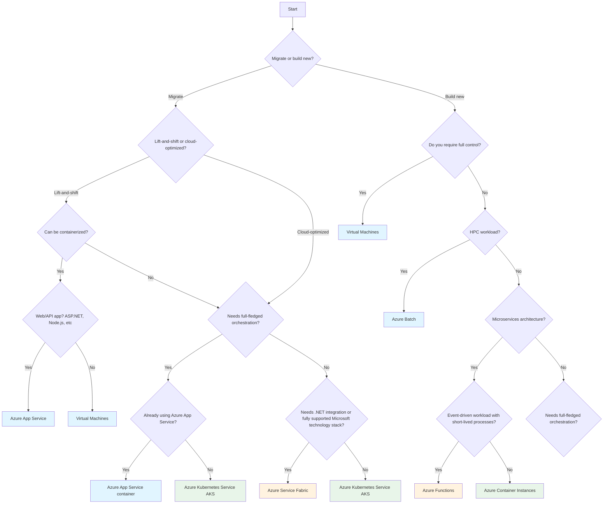

```mermaid


graph TD
    Start["Start"]
    
    Start --> Q1{"Migrate or build new?"}
    
    Q1 -->|Migrate| Q2{"Lift-and-shift or cloud-optimized?"}
    Q1 -->|Build new| Q3{"Do you require full control?"}
    
    Q2 -->|Lift-and-shift| Q4{"Can be containerized?"}
    Q2 -->|Cloud-optimized| Q5{"Needs full-fledged orchestration?"}
    
    Q3 -->|Yes| VM["Virtual Machines"]
    Q3 -->|No| Q6{"HPC workload?"}
    
    Q6 -->|Yes| Batch["Azure Batch"]
    Q6 -->|No| Q7{"Microservices architecture?"}
    
    Q7 -->|Yes| Q8{"Event-driven workload with short-lived processes?"}
    Q7 -->|No| Q9{"Needs full-fledged orchestration?"}
    
    Q8 -->|Yes| Functions["Azure Functions"]
    Q8 -->|No| ACI["Azure Container Instances"]
    
    Q4 -->|Yes| Q10{"Web/API app? ASP.NET, Node.js, etc"}
    Q4 -->|No| Q5
    
    Q10 -->|Yes| AppService1["Azure App Service"]
    Q10 -->|No| VM2["Virtual Machines"]
    
    Q5 -->|Yes| Q11{"Already using Azure App Service?"}
    Q5 -->|No| Q12{"Needs .NET integration or fully supported Microsoft technology stack?"}
    
    Q11 -->|Yes| AppServiceContainer["Azure App Service container"]
    Q11 -->|No| AKS1["Azure Kubernetes Service AKS"]
    
    Q12 -->|Yes| ServiceFabric["Azure Service Fabric"]
    Q12 -->|No| AKS2["Azure Kubernetes Service AKS"]
    
    style VM fill:#e1f5ff
    style Batch fill:#e1f5ff
    style Functions fill:#fff3e0
    style ACI fill:#e8f5e9
    style AppService1 fill:#e1f5ff
    style VM2 fill:#e1f5ff
    style AppServiceContainer fill:#e1f5ff
    style AKS1 fill:#e8f5e9
    style ServiceFabric fill:#fff3e0
    style AKS2 fill:#e8f5e9
 

```
