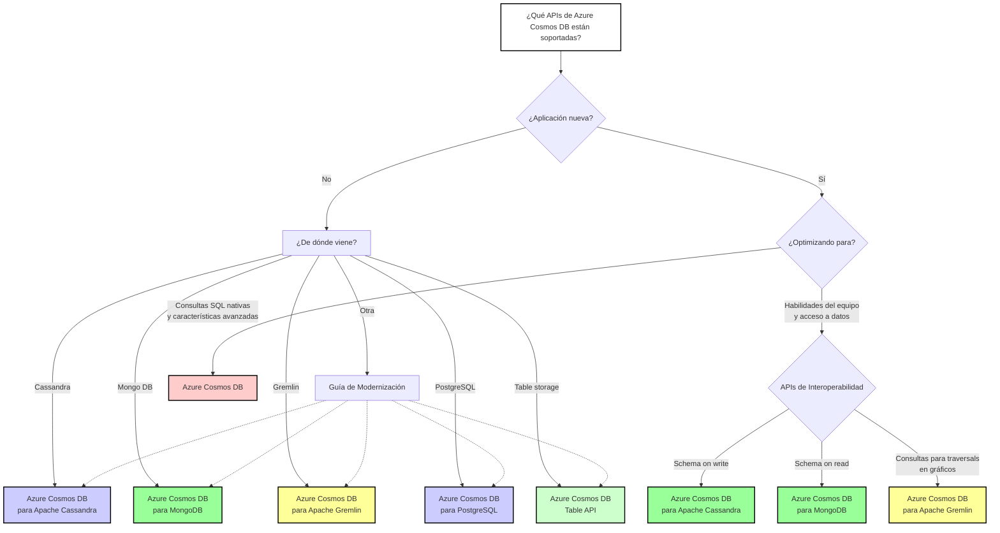

# CosmoDB Options

```mermaid
graph TD
    A["¿Qué APIs de Azure Cosmos DB están soportadas?"] --> B{¿Aplicación nueva?}
    
    B -->|No| C["¿De dónde viene?"]
    B -->|Sí| D{¿Optimizando para?}
    
    C -->|Otra| E["Guía de Modernización"]
    
    C -->|Cassandra| F["Azure Cosmos DB<br/>para Apache Cassandra"]
    C -->|Mongo DB| G["Azure Cosmos DB<br/>para MongoDB"]
    C -->|Gremlin| H["Azure Cosmos DB<br/>para Apache Gremlin"]
    C -->|PostgreSQL| I["Azure Cosmos DB<br/>para PostgreSQL"]
    C -->|Table storage| J["Azure Cosmos DB<br/>Table API"]
    
    D -->|Habilidades del equipo<br/>y acceso a datos| K{APIs de Interoperabilidad}
    D -->|Consultas SQL nativas<br/>y características avanzadas| L["Azure Cosmos DB"]
    
    K -->|Schema on write| M["Azure Cosmos DB<br/>para Apache Cassandra"]
    K -->|Schema on read| N["Azure Cosmos DB<br/>para MongoDB"]
    K -->|Consultas para traversals<br/>en gráficos| O["Azure Cosmos DB<br/>para Apache Gremlin"]
    
    E -.-> F
    E -.-> G
    E -.-> H
    E -.-> I
    E -.-> J
    
    style A fill:#fff,stroke:#000,stroke-width:2px
    style L fill:#ffcccc,stroke:#000,stroke-width:2px
    style M fill:#99ff99,stroke:#000,stroke-width:2px
    style N fill:#99ff99,stroke:#000,stroke-width:2px
    style G fill:#99ff99,stroke:#000,stroke-width:2px
    style O fill:#ffff99,stroke:#000,stroke-width:2px
    style H fill:#ffff99,stroke:#000,stroke-width:2px
    style F fill:#ccccff,stroke:#000,stroke-width:2px
    style I fill:#ccccff,stroke:#000,stroke-width:2px
    style J fill:#ccffcc,stroke:#000,stroke-width:2px
```
