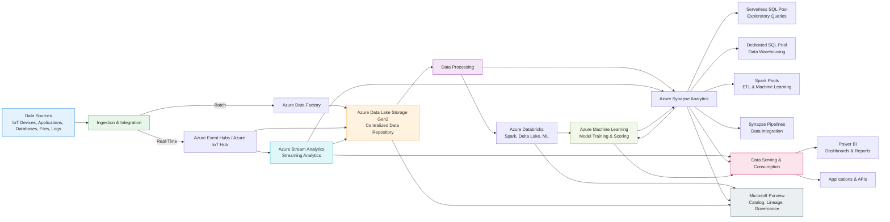

# 📊 Resumen del Proceso de Integración y Analítica de Datos en Azure

El diseño de una solución de integración y análisis de datos en Azure sigue un **enfoque end-to-end** que transforma datos crutos provenientes de múltiples fuentes en información valiosa para la toma de decisiones. Este proceso permite a las organizaciones **capturar, almacenar, procesar, enriquecer y visualizar datos**, soportando tanto **procesamiento batch** como **análisis en tiempo real**.

El flujo comienza con la **generación de datos** desde sistemas transaccionales, dispositivos IoT, aplicaciones empresariales, archivos o logs. Estos datos son posteriormente **ingeridos** en la plataforma mediante servicios especializados que permiten su integración desde entornos cloud, on-premises o SaaS.

Una vez integrados, los datos se almacenan en un **repositorio analítico centralizado**, generalmente un **Data Lake**, que actúa como la “fuente única de la verdad”. Este enfoque permite conservar los datos en su formato original y facilita su acceso por diferentes equipos y herramientas analíticas.

Posteriormente, los datos son **procesados y transformados** para convertirlos en información útil. Este procesamiento puede realizarse de forma **batch**, mediante motores de análisis masivo como Apache Spark o data warehouses, o en **tiempo real**, utilizando motores de procesamiento de eventos que permiten obtener insights inmediatos.

En etapas más avanzadas, los datos pueden ser **enriquecidos** mediante modelos de **machine learning** o integraciones con otras plataformas analíticas, agregando valor predictivo y prescriptivo a la información.

Finalmente, los resultados son **servidos y consumidos** por usuarios de negocio a través de herramientas de **visualización y reporting**, permitiendo la toma de decisiones basada en datos. Este consumo también puede darse mediante aplicaciones o APIs que integren los insights en procesos operativos.

### 🔄 Flujo General del Proceso

1. **Generación de datos** desde múltiples fuentes.
2. **Ingesta e integración** de datos batch y en tiempo real.
3. **Almacenamiento** en un repositorio analítico centralizado (Data Lake).
4. **Procesamiento y transformación** mediante motores analíticos.
5. **Enriquecimiento** con analítica avanzada y machine learning.
6. **Exposición y consumo** de la información a través de dashboards o aplicaciones.

### 🎯 Objetivos del Proceso

* **Centralizar la información** proveniente de diversas fuentes.
* **Escalar el procesamiento** de grandes volúmenes de datos.
* **Habilitar analítica batch y en tiempo real**.
* **Facilitar la gobernanza y seguridad de los datos**.
* **Permitir la toma de decisiones basada en datos**.
* **Democratizar el acceso a la información** dentro de la organización.

---

# 🧩 Etapas del Proceso y Servicios de Azure

A continuación, se detallan las etapas del proceso junto con los principales **servicios de Azure** utilizados y su propósito dentro de la arquitectura.

---

## 1. Origen de los Datos (Data Sources)

### 📌 Descripción

El proceso comienza con la generación de datos desde múltiples sistemas y formatos, tanto estructurados como no estructurados.

### ☁️ Servicios de Azure

* **Azure IoT Hub**: Ingesta de telemetría desde dispositivos IoT.
* **Azure Event Hubs**: Captura de grandes volúmenes de eventos en streaming.
* **Azure Blob Storage**: Recepción inicial de archivos y datos sin procesar.
* **Bases de datos operacionales**: Azure SQL Database, SQL Server, SAP, entre otros.

### 🎯 Propósito

Capturar y centralizar los datos generados por los sistemas de origen para su posterior procesamiento.

---

## 2. Ingesta y Orquestación de Datos

### 📌 Descripción

En esta etapa se coordinan los procesos de extracción, transformación y carga (ETL/ELT), asegurando que los datos lleguen al almacenamiento analítico de forma confiable y repetible.

### ☁️ Servicios de Azure

* **Azure Data Factory (ADF)**

  * Orquesta pipelines de datos.
  * Permite integrar fuentes cloud, on-premises y SaaS.
  * Soporta ejecución programada y dependencias.
  * Utiliza **Self-hosted Integration Runtime** para escenarios híbridos.

* **Azure Event Hubs / IoT Hub**

  * Permiten la ingestión de datos en tiempo real.

### 🎯 Propósito

Automatizar y gobernar el movimiento de datos dentro de la plataforma.

---

## 3. Almacenamiento Analítico Centralizado

### 📌 Descripción

Los datos ingeridos se almacenan en un repositorio escalable que permite conservar grandes volúmenes de información en su formato original.

### ☁️ Servicios de Azure

* **Azure Data Lake Storage Gen2**

  * Almacenamiento optimizado para analítica de big data.
  * Soporte para **namespace jerárquico** y compatibilidad con **HDFS**.
  * Seguridad granular mediante **ACLs** y **RBAC**.
  * Alta escalabilidad y eficiencia en costos.

* **Azure Blob Storage**

  * Alternativa para almacenamiento de objetos cuando no se requiere un enfoque analítico.

### 🎯 Propósito

Actuar como la “fuente única de la verdad” y permitir el acceso a los datos por múltiples herramientas analíticas.

---

## 4. Procesamiento y Transformación de Datos

### 📌 Descripción

En esta etapa los datos son limpiados, transformados y preparados para su análisis. El procesamiento puede ser batch o en tiempo real.

### ☁️ Servicios de Azure

* **Azure Databricks**

  * Plataforma colaborativa basada en **Apache Spark**.
  * Ideal para ingeniería de datos, analítica avanzada y machine learning.
  * Implementa la arquitectura **Lakehouse** con **Delta Lake** (capas Bronze, Silver y Gold).

* **Azure Synapse Analytics**

  * Plataforma analítica integrada que combina data warehousing y big data.
  * **Dedicated SQL Pool**: consultas con rendimiento predecible.
  * **Serverless SQL Pool**: consultas bajo demanda sobre el Data Lake.
  * **Spark Pools**: procesamiento distribuido y machine learning.
  * **Pipelines**: integración de datos integrada (similar a Data Factory).
  * **Synapse Link**: analítica casi en tiempo real sobre bases operacionales.

### 🎯 Propósito

Transformar los datos en información estructurada y lista para el análisis empresarial.

---

## 5. Procesamiento en Tiempo Real

### 📌 Descripción

Permite analizar eventos a medida que ocurren, generando insights inmediatos y posibilitando acciones automáticas.

### ☁️ Servicios de Azure

* **Azure Stream Analytics**

  * Motor de procesamiento de eventos en tiempo real.
  * Permite consultas tipo SQL sobre flujos de datos.
  * Soporta agregaciones, ventanas temporales y correlación de eventos.
  * Puede enviar resultados a múltiples destinos como Data Lake, Synapse, SQL Database o Power BI.

### 🎯 Propósito

Obtener información en tiempo real y habilitar respuestas inmediatas a eventos del negocio.

---

## 6. Enriquecimiento con Machine Learning

### 📌 Descripción

Los datos procesados pueden enriquecerse mediante modelos predictivos que agregan valor analítico adicional.

### ☁️ Servicios de Azure

* **Azure Machine Learning**

  * Entrenamiento, despliegue y gestión de modelos de ML.
  * Implementación de endpoints para scoring en tiempo real o batch.
  * Integración con Databricks y Synapse.

### 🎯 Propósito

Incorporar capacidades predictivas y prescriptivas en la solución analítica.

---

## 7. Gobernanza y Catalogación de Datos

### 📌 Descripción

La gobernanza asegura la calidad, seguridad y trazabilidad de los datos a lo largo de todo su ciclo de vida.

### ☁️ Servicios de Azure

* **Microsoft Purview**

  * Catálogo de datos unificado.
  * Descubrimiento y clasificación automática.
  * Linaje de datos y políticas de gobernanza.

### 🎯 Propósito

Garantizar el control y la confianza en los datos utilizados por la organización.

---

## 8. Consumo y Visualización de la Información

### 📌 Descripción

La etapa final consiste en presentar los datos procesados a los usuarios de negocio para facilitar la toma de decisiones.

### ☁️ Servicios de Azure

* **Power BI**

  * Creación de dashboards interactivos y reportes.
  * Conexión a Synapse, Data Lake y otros orígenes.
  * Visualización en tiempo real y análisis self-service.

### 🎯 Propósito

Transformar los datos en insights accionables y accesibles para los usuarios.

---

# 🧭 Conclusión

El proceso de integración y analítica de datos en Azure sigue un **flujo estructurado y escalable**, donde cada servicio cumple un rol específico dentro de una arquitectura moderna de datos. Desde la ingestión hasta la visualización, Azure ofrece un ecosistema completo que permite soportar **analítica descriptiva, diagnóstica, predictiva y prescriptiva**, facilitando la toma de decisiones basada en datos.

