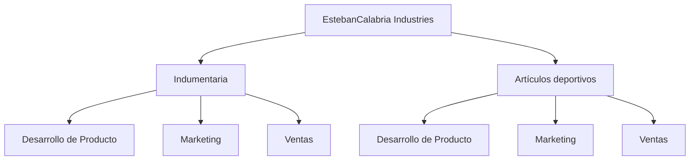
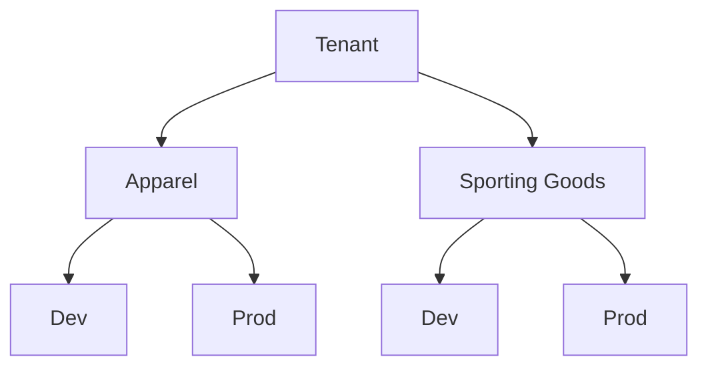
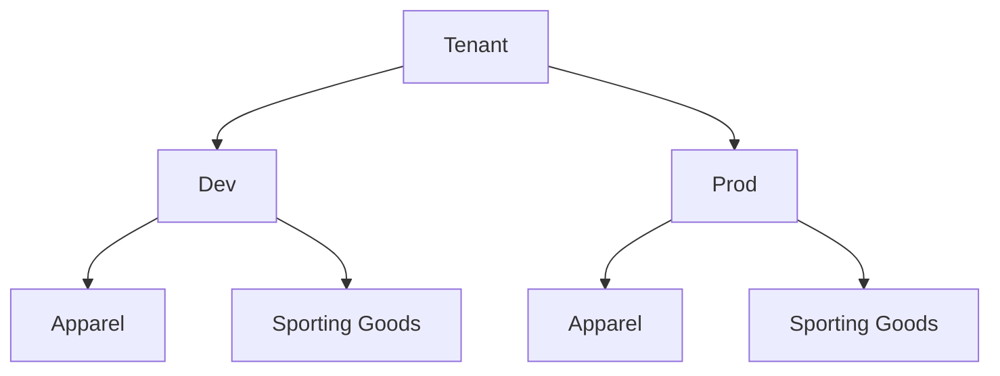
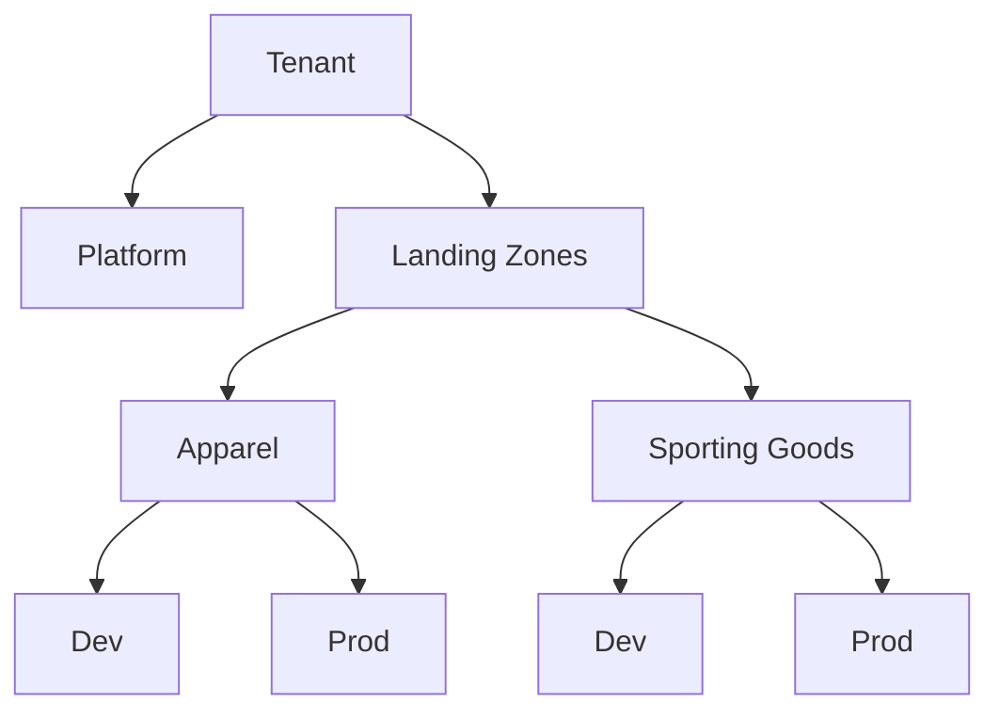

# 🧩 Caso de estudio: Diseño de una solución de gobernanza

## 🏢 Contexto

* **EstebanCalabria Industries** está planificando definir en su estrategia de gobernanza en Azure.
* Realizar un asesoramiento como arquitecto de soluciones Azure, con el objetivo de definir recomendaciones, al y responder a una serie de requerimientos clave.

---

## 📋 Situacion Actual

EstebanCalabria Industries cuenta con dos unidades de negocio principales:

* Apparel (Indumentaria)
* Sporting Goods (Artículos deportivos)

Cada unidad de negocio está compuesta por tres departamentos:

* Desarrollo de Producto
* Marketing
* Ventas

## 📋 Requisitos

* Cada unidad de negocio y sus respectivos departamentos deben poder **gestionar y monitorear sus propios costos en Azure**.
* Al mismo tiempo, el equipo de **IT corporativo** necesita contar con una **visión global de los costos de toda la organización**, permitiendo generar reportes consolidados.

## 📊 Enunciado

* ¿De qué formas podría EstebanCalabria Industries organizar sus **suscripciones y management groups**?
* ¿Cuál de esas opciones sería la más adecuada para cumplir con los requisitos planteados?
* Diseñar **dos jerarquías alternativas** y explicar el proceso de toma de decisiones.

## Tema a Analizar

* Estructura de la empresa
* Management Groups
* Subscriptions
* Costos por unidad

---

##  ¿De qué formas podría EstebanCalabria Industries organizar sus **suscripciones y management groups**

## 📊 Opciones

* Organización por unidad de negocio
* Organización por entorno
* Modelo híbrido (avanzado)

### 🧩 Opción 1 — Organización por unidad de negocio

**✅ Pros**

* Refleja la estructura organizacional real
* Ownership claro por unidad de negocio
* Fácil asignación de responsabilidades (RBAC)
* Costos visibles por negocio sin depender tanto de tags

**❌ Contras**

* Duplicación de políticas entre unidades
* Más difícil aplicar governance centralizada por entorno
* Comparación entre entornos (Dev vs Prod) menos directa

---

### 🧩 Opción 2 — Organización por entorno

**✅ Pros**

* Governance centralizada por entorno
* Aplicación de políticas más simple (ej: Prod más restrictivo)
* Mejor control de seguridad y compliance
* Comparación clara entre entornos

**❌ Contras**

* Costos por unidad de negocio menos visibles sin tags
* Ownership menos intuitivo
* Mayor dependencia de tagging para reporting

---

### 🧩 Opción 3 — Modelo híbrido (avanzado)

* En Platform normalmente ponés recursos compartidos y críticos:
    * Redes virtuales globales (VNet)
    * VPN / ExpressRoute
    * Firewall y Network Security Groups compartidos
    * Azure Policy / RBAC a nivel corporativo
    * Storage compartido (ej: logs, backups)
    * Azure Monitor / Log Analytics central
* Cada unidad de negocio o proyecto tiene su Landing Zone:
    * Subscriptions separadas (Dev / Prod)
    * Resource Groups para apps / servicios específicos
    * Policies específicas del proyecto (naming, size limits)
    * Tags para tracking de costos

**✅ Pros**

* Escalable para escenarios enterprise
* Separación clara entre plataforma y workloads
* Permite governance centralizada + flexibilidad
* Alineado con buenas prácticas (Landing Zones)

**❌ Contras**

* Mayor complejidad inicial
* Más difícil de explicar para equipos no técnicos
* Puede ser excesivo para escenarios pequeños

---

## ⚙️ Implementación en Azure

Durante la demo, mostrar:

* **Tenant (Microsoft Entra ID)**
* **Management Groups**

  * Crear un Management Group (ej: `Apparel`)
  * Mostrar jerarquía
* **Subscriptions**

  * Visualizar subscriptions existentes
  * Mover una subscription entre Management Groups

*(Opcional)*

* Mostrar asignación de permisos básicos (RBAC a nivel MG)

---

## 🎯  ¿Cuál de esas opciones sería la más adecuada para cumplir con los requisitos planteados?

Para este escenario, la mejor opción es:

👉 **Opción 1 — Organización por unidad de negocio**

**Justificación:**

* El requerimiento principal es que cada unidad y departamento pueda **gestionar y monitorear sus propios costos**
* Esta estructura permite una **asignación clara de ownership**
* Reduce la necesidad de depender exclusivamente de tags para segmentar costos
* Es más simple y alineada con la estructura actual de la empresa

👉 En este contexto, la simplicidad y claridad organizacional tienen más valor que una gobernanza centralizada por entorno.

---

## 🔗 Puente al siguiente escenario

Ahora que tenemos definida la estructura de management groups y subscriptions, veamos cómo se aplicaría esta gobernanza a un **proyecto real**, incluyendo:

* Tracking de costos por proyecto
* Naming y sizing de VMs
* Políticas de cumplimiento
* Aplicación de Well-Architected Framework
