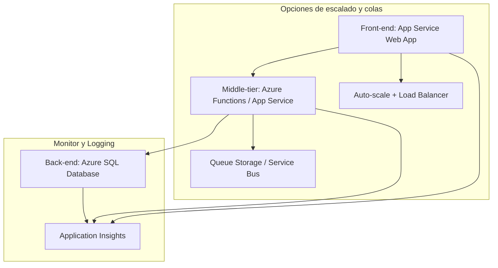

# 🧩 Caso de estudio: Diseño de una solución de Compute

## 🏢 Contexto

* **EstebanCalabria Industries** desea modernizar su aplicación de catálogo de productos y migrarla a la nube.
* La aplicación actual tiene una configuración **3-tier**: Front-end (.NET Core), Middle-tier (business logic), Back-end (SQL Server).
* El equipo de TI solicita recomendaciones sobre **servicios de Azure** para mejorar rendimiento, escalabilidad y eficiencia.

---

## 📋 Situación Actual

* **Front-end**: Aplicación web .NET Core en IIS.

  * Durante picos: 1.750 clientes/hora.
  * Problema: Durante ofertas y feriados, los servidores alcanzan el límite de rendimiento.
  * Off-peak: servidores inactivos gran parte del tiempo.

* **Middle-tier**: Procesa solicitudes de soporte (75–125 solicitudes/hora).

  * Problema: Las solicitudes se acumulan en cola, tiempos de espera largos.

* **Back-end**: Base de datos SQL Server para pedidos.

  * Rendimiento actual adecuado.

* **Restricción**: Todos los recursos deben permanecer en **una sola región** por requerimientos legales.

---

## 🧠 Enunciado

1. **Front-end tier**: Qué servicio de Azure recomiendas y por qué.
2. **Middle-tier**: Qué servicio de Azure recomiendas y por qué.
3. ¿Cómo incorporás los **pilares del Well-Architected Framework** para lograr una arquitectura:

   * de alta calidad
   * estable
   * eficiente

---

## 🏗️ Arquitectura propuesta (3-tier en Azure)

---

## 🏗️ Opciones de Azure Compute

### 🟢 Front-end tier — Aplicación web de alto tráfico

**Recomendación:** **Azure App Service (Web App)**

**✅ Pros**

* Escalado automático según tráfico → perfecto para picos de clientes.
* No requiere gestión de IIS ni del SO → reduce operación y costos.
* Integración nativa con .NET Core y CI/CD (GitHub, Azure DevOps).
* Alta disponibilidad dentro de la región.

**❌ Contras**

* Menor control sobre el sistema operativo comparado con VMs.
* Limitado si la app necesita personalizaciones profundas del servidor web.

**💡 Qué mostrar en Azure:**

* Crear un **App Service Plan** y Web App.
* Configurar **Auto-scaling** basado en CPU o requests.
* Revisar métricas de rendimiento y escalado automático.
* Mostrar integración con **Deployment Center** (GitHub Actions/CI-CD).

---

### 🟡 Middle-tier — Business logic

**Recomendación:** **Azure Functions / App Service (Web Jobs)**

**✅ Pros**

* Escalado automático según demanda (event-driven).
* Pago solo por ejecución → costos bajos durante off-peak.
* Fácil integración con **Azure Queue Storage** o **Service Bus** para gestionar solicitudes en cola.

**❌ Contras**

* Puede requerir refactorización de la lógica de negocio.
* Limits de ejecución por plan serverless (se pueden ajustar).

**💡 Qué mostrar en Azure:**

* Crear una **Function App** con trigger de **Queue Storage**.
* Configurar **colade de mensajes** para simular solicitudes de clientes.
* Mostrar cómo se escala automáticamente según número de mensajes.
* Integrar con **Application Insights** para logging y métricas de ejecución.

---

### 🔵 Back-end tier — Base de datos

**Recomendación:** **Azure SQL Database / Managed Instance**

**✅ Pros**

* Administración simplificada (backups automáticos, updates).
* Integración con Active Directory para seguridad.
* Alta disponibilidad dentro de la región.

**💡 Qué mostrar en Azure:**

* Crear **Azure SQL Database** o **Managed Instance**.
* Configurar **Backups automáticos** y revisar métricas de rendimiento.
* Revisar DTU/CPU y mostrar alertas de performance.

---

## 🏗️ Arquitectura — Aplicando Well-Architected Framework

**Pilares principales a destacar en la explicación:**

* **Fiabilidad (Reliability)** → Auto-scale en Front-end y Middle-tier, colas para evitar pérdidas de solicitudes.
* **Rendimiento (Performance Efficiency)** → Ajuste de App Service Plan y triggers serverless.
* **Optimización de costos (Cost Optimization)** → Pago por ejecución en serverless, escalado automático, evitar recursos ociosos.
* **Seguridad (Security)** → App Service con HTTPS, autenticación Azure AD, acceso restringido a la base de datos.
* **Operaciones (Operational Excellence)** → Application Insights para telemetría, alertas y logging.

**💡 Qué mostrar en Azure:**

* App Service auto-scale y métricas de CPU/requests.
* Function App con colas y logs.
* SQL Database con métricas y backups.
* Application Insights → telemetría de toda la solución.

