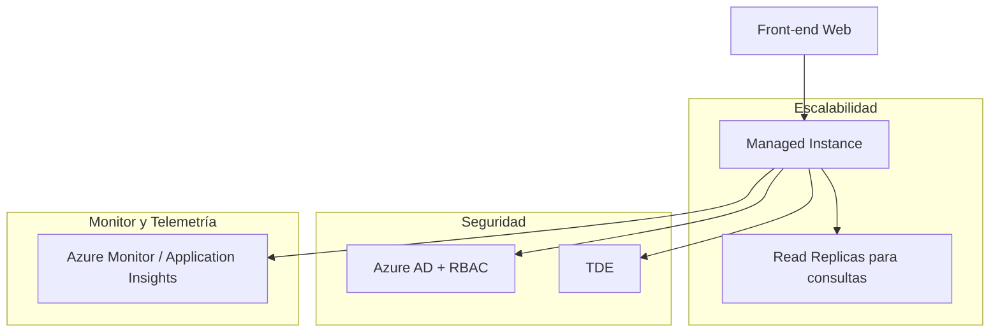

# 🧩 Caso de estudio: Diseño de una solución de Relational Storage

## 🏢 Contexto

* **EstebanCalabria Industries** está migrando la base de datos de su sitio web público a Azure, junto con el front-end que se desplegará inicialmente en **2 regiones** para redundancia.
* La base de datos contiene el **catálogo de productos y los pedidos en línea**.
* Actualmente corre en un **Microsoft SQL Server Always On Availability Group** en on-premises.
* La empresa busca mejorar **alta disponibilidad, rendimiento y seguridad**, cumpliendo buenas prácticas de arquitectura en la nube.

---

## 📋 Situación Actual

* **Alta disponibilidad**: La base de datos es crítica; cualquier caída puede generar pérdida de ventas o confianza del cliente.  
* **Rendimiento web**: Realizar pedidos funciona bien, pero navegar y buscar productos con muchas entradas es “lento”.  
* **Seguridad**: Preocupación por información personal y financiera; se requiere cumplir con estándares de la industria.  

```mermaid
graph TD
    EC[EstebanCalabria Industries]

    EC --> DB[SQL Server On-Premises]
    EC --> FE[Front-end Web]

    FE --> DB
````

---

## 📋 Requisitos

* La base de datos debe ser **altamente disponible** y escalable.
* Debe garantizar **rendimiento adecuado** para búsquedas y pedidos.
* Implementar **autenticación, autorización y seguridad** de datos sensibles.
* Cumplir con **buenas prácticas y Well-Architected Framework**.
* La arquitectura debe permitir **expansión a otras regiones** en el futuro.

---

## 📊 Enunciado

* Diseñar la solución de base de datos en Azure.
* Diagramar la arquitectura elegida y explicar las decisiones.
* Explicar cómo se aplican los pilares del **Well-Architected Framework**:

  * Fiabilidad
  * Rendimiento
  * Seguridad
  * Optimización de costos
  * Operaciones

---

## 📊 Opciones de arquitectura

### 🧩 Opción 1 — Azure SQL Database con Geo-Replication

```mermaid
graph TD
    FE[Front-end Web] --> DB[Azure SQL Database]
    
    subgraph "Alta disponibilidad"
        DB --> Geo[Geo-Replication / Failover Group]
    end
    
    subgraph "Seguridad"
        DB --> IAM[Azure AD + RBAC]
        DB --> TDE[TDE - Transparent Data Encryption]
        DB --> Auditing[Auditing & Logs]
    end
    
    subgraph "Monitor y Telemetría"
        DB --> AI[Azure Monitor / Application Insights]
    end
```

**✅ Pros**

* Alta disponibilidad con replicación geo-redundante.
* Escalado dinámico según carga (vCore / DTU / Hyperscale).
* Integración con **Azure AD** y seguridad nativa.
* Backups automáticos y retención configurable.

**❌ Contras**

* Costos mayores al usar múltiples regiones.
* Limitado control del servidor comparado con IaaS.

**💡 Qué mostrar en Azure**

* Crear **Azure SQL Database**.
* Configurar **Geo-Replication** y **Failover Group**.
* Revisar métricas de **CPU, DTU, IOPS**.
* Activar **TDE** y **Auditing**.
* Simular failover entre regiones.

---

### 🧩 Opción 2 — Managed Instance con Read Replicas



**✅ Pros**

* Lecturas distribuidas mejoran rendimiento de catálogo.
* Escalado transparente de recursos.
* Control de seguridad integrado con Azure AD y roles RBAC.

**❌ Contras**

* Más complejo mantener consistencia entre replicas.
* Costos adicionales según número de replicas y tamaño de instancia.

**💡 Qué mostrar en Azure**

* Crear **Managed Instance**.
* Configurar **Read Replicas** y elastic pools si se requiere.
* Revisar métricas de rendimiento y latencia.
* Activar TDE, Auditing y logs.
* Integrar con **Azure Monitor** y **Application Insights**.

---

## ⚙️ Aplicación del Well-Architected Framework

* **Fiabilidad (Reliability)** → Geo-Replication, Failover Groups, backups automáticos.
* **Rendimiento (Performance Efficiency)** → Read replicas, Hyperscale, elastic pools.
* **Seguridad (Security)** → TDE, Azure AD, RBAC, auditing.
* **Optimización de costos (Cost Optimization)** → Escalado dinámico, replicas solo donde se necesitan.
* **Operaciones (Operational Excellence)** → Azure Monitor, Application Insights, alertas y métricas.

**💡 Qué mostrar en Azure**

* SQL Database o Managed Instance con Failover Groups.
* Simulación de failover y lectura desde replicas.
* Auditoría, TDE y logs de seguridad.
* Telemetría completa con Azure Monitor y Application Insights.

