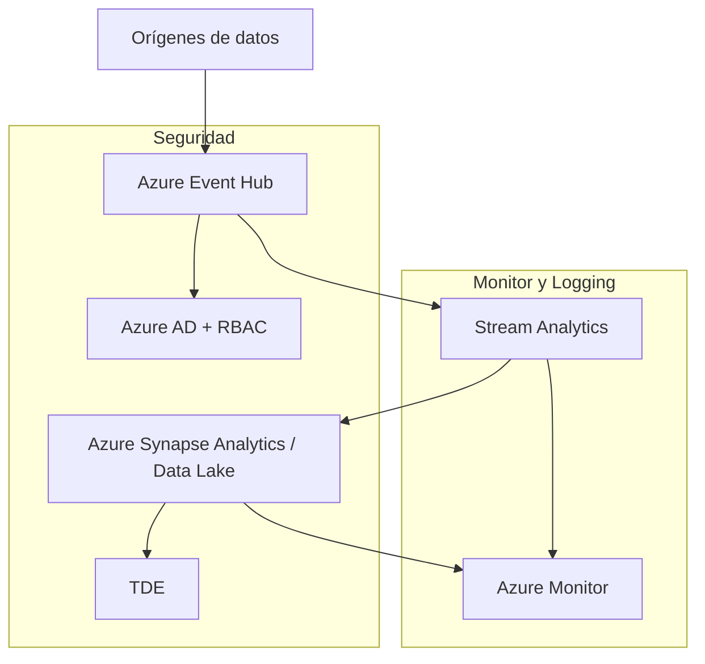

# 🧩 Caso de estudio: Diseño de una solución de Data Integration

## 🏢 Contexto

* **EstebanCalabria Industries** quiere consolidar datos de sus distintas unidades de negocio (Apparel y Sporting Goods) en **Azure**, para análisis y reportes centralizados.
* Actualmente, los datos se encuentran dispersos en:  
  * Bases de datos SQL on-premises  
  * Archivos CSV/Excel en SharePoint  
  * Aplicaciones SaaS externas (CRM y ERP)  
* La empresa necesita un **pipeline de integración** confiable, seguro y escalable para reportes diarios y análisis de tendencias.

---

## 📋 Situación Actual

* Datos fragmentados por unidad de negocio y sistema.  
* Procesos manuales para consolidar información.  
* Retrasos en reportes y toma de decisiones por inconsistencias y tiempo de procesamiento.  
* Necesidad de **cumplir con políticas de seguridad y privacidad** en la integración de datos.

```mermaid
graph TD
    EC[EstebanCalabria Industries]

    EC --> ApparelDB[DB Apparel On-Premises]
    EC --> SGDB[DB Sporting Goods On-Premises]
    EC --> SaaS[SaaS Apps: CRM / ERP]
    EC --> Files[Archivos CSV / Excel]

    ApparelDB --> DI[Azure Data Factory / Synapse Pipelines]
    SGDB --> DI
    SaaS --> DI
    Files --> DI

    DI --> DW[Azure Data Warehouse / Synapse Analytics]
    DW --> BI[Power BI / Reporting]
````

---

## 📋 Requisitos

* Consolidar datos de todas las unidades y sistemas.
* Procesamiento diario de datos para análisis.
* Transformaciones de datos (ETL/ELT) seguras y eficientes.
* Cumplir con políticas de seguridad, auditoría y gobernanza.
* Integración escalable para soportar crecimiento futuro.

---

## 📊 Enunciado

* Diseñar la solución de **Data Integration** en Azure.
* Diagramar la arquitectura elegida y explicar decisiones.
* Aplicar los pilares del **Well-Architected Framework**:

  * Fiabilidad
  * Rendimiento
  * Seguridad
  * Optimización de costos
  * Operaciones

---

## 📊 Opciones de arquitectura

### 🧩 Opción 1 — Azure Data Factory + Azure Synapse

```mermaid
graph TD
    Source[Orígenes de datos] --> ADF[Azure Data Factory]
    ADF --> DW[Azure Synapse Analytics]

    subgraph "Seguridad"
        ADF --> IAM[Azure AD + RBAC]
        DW --> TDE[TDE + Column Level Security]
    end

    subgraph "Monitor y Logging"
        ADF --> AI[Azure Monitor / Application Insights]
        DW --> AI
    end
```

**✅ Pros**

* Pipeline centralizado y automatizado.
* Escalable y serverless → pago por ejecución.
* Integración nativa con múltiples fuentes (SQL, CSV, SaaS).
* Transformaciones ETL/ELT eficientes y seguras.
* Monitorización completa con Azure Monitor y logs.

**❌ Contras**

* Requiere aprendizaje de ADF y Synapse para configuración avanzada.
* Procesamiento complejo puede generar costos si no se optimiza.

**💡 Qué mostrar en Azure**

* Crear **Data Factory** y pipeline ETL.
* Conectar fuentes: SQL on-prem, SharePoint/Excel, SaaS.
* Configurar **Linked Services, Datasets y Activities**.
* Mostrar ejecución de pipeline y monitorización.
* Crear **Synapse Analytics** como Data Warehouse.
* Configurar TDE y Column-Level Security.
* Integrar con **Power BI** para reportes.

---

### 🧩 Opción 2 — Event-Driven Integration con Event Hub + Stream Analytics



**✅ Pros**

* Integración en tiempo real de datos críticos (event-driven).
* Escalabilidad horizontal automática según volumen de eventos.
* Permite analytics near real-time en Synapse / Data Lake.

**❌ Contras**

* Más complejo de implementar que ETL batch.
* Costos variables según volumen de eventos.

**💡 Qué mostrar en Azure**

* Crear **Event Hub** y simulación de eventos.
* Configurar **Stream Analytics Job** para procesar eventos.
* Integrar salida en **Synapse Analytics / Data Lake**.
* Monitorear throughput y latencia.
* Seguridad con RBAC y TDE en Synapse / Data Lake.

---

## ⚙️ Aplicación del Well-Architected Framework

* **Fiabilidad (Reliability)** → Pipelines automatizados, retry policies, geo-redundancy.
* **Rendimiento (Performance Efficiency)** → Paralelismo en ADF, Stream Analytics, elastic pools.
* **Seguridad (Security)** → Azure AD, RBAC, TDE, auditing.
* **Optimización de costos (Cost Optimization)** → Pago por ejecución, escalado automático, purga de datos históricos.
* **Operaciones (Operational Excellence)** → Monitorización con Azure Monitor, alertas y logs, integración con Power BI para reportes.

**💡 Qué mostrar en Azure**

* Pipelines ADF y ejecución ETL.
* Data Lake / Synapse con métricas y auditoría.
* Event Hub y Stream Analytics en acción.
* Power BI conectado al Data Warehouse para reportes.
* Telemetría completa en Azure Monitor y Application Insights.


```
