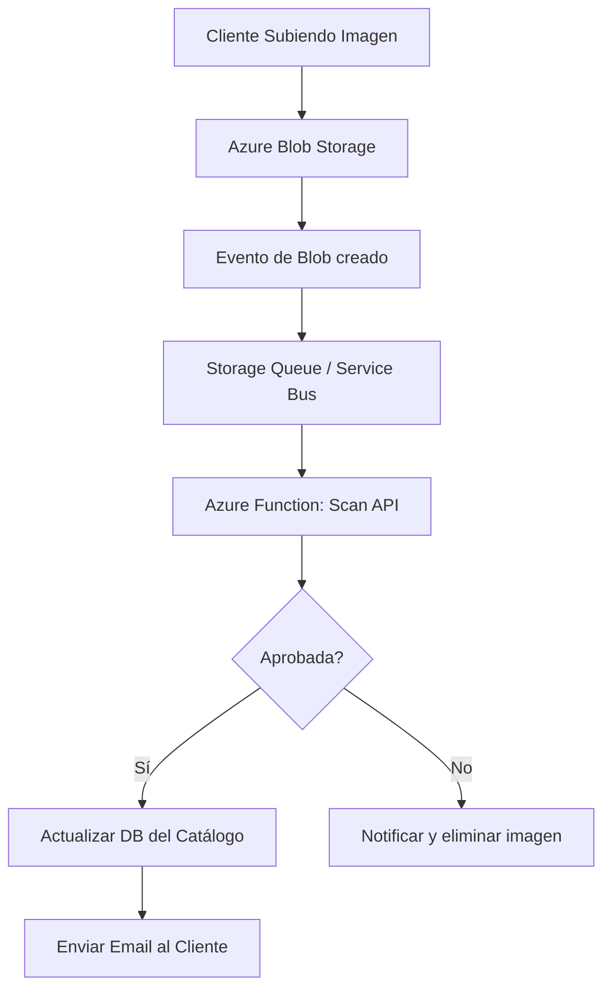

# 🧩 Caso de estudio: Diseño de una solución de arquitectura de aplicación

## 🏢 Contexto

* **EstebanCalabria Industries** quiere actualizar su sitio web para que los clientes puedan **subir fotos de los productos que adquirieron**.  
* La empresa considera que las imágenes de clientes ayudan a aumentar confianza y conversión.  
* Ya existe una **API interna** que realiza el escaneo de las imágenes para detectar contenido que pueda ser inapropiado o generar problemas legales.  
* Se busca una solución **serverless**, escalable y de bajo costo que pueda manejar picos de carga y notificar al cliente una vez que su imagen sea aprobada.
* Una vez que la foro esta aprobada voy a guardar su descripcion y ubicacion en mi base de datos de productos
* Voy a mandar un correo para avisarle al usuario que su imagen se proceso con exito.

---

## 📋 Situación Actual

* Las cargas de imágenes son **irregulares a lo largo del día**.  
* El software de escaneo interno puede ser un **cuello de botella** durante picos de carga.  
* Se requiere que todos los archivos sean procesados y que la base de datos del catálogo se actualice correctamente.  
* La empresa desea minimizar costos usando **soluciones serverless** y pagar solo por lo que se use.

```mermaid
graph TD
    EC[EstebanCalabria Industries]

    Customer[Cliente Subiendo Imagen] --> Storage[Azure Blob Storage - Upload]
    Storage --> Queue[Azure Storage Queue / Service Bus]

    Queue --> Scan[Función Serverless: Llamada a API de Escaneo Interna]
    Scan --> Approved[Imagen Aprobada?]

    Approved -->|Sí| Catalog[Actualizar Base de Datos del Catálogo]
    Catalog --> Email[Notificar Cliente vía SendGrid / Logic Apps]

    Approved -->|No| Reject[Notificar rechazo / eliminar imagen]

    subgraph "Monitor y Logging"
        Storage --> AI[Application Insights]
        Scan --> AI
        Catalog --> AI
    end
````

---

## 📋 Requisitos

* Escaneo de imágenes para contenido inapropiado.
* Manejo de cargas irregulares y picos de subida.
* Notificación automática al cliente luego de la aprobación.
* Minimizar costos y mantenimiento operativo.
* Integración con la base de datos del catálogo existente.

---

## 📊 Enunciado

* Diseñar la arquitectura de la aplicación en Azure.
* Diagramar la arquitectura elegida y explicar decisiones.
* Aplicar los pilares del **Well-Architected Framework**:

  * Fiabilidad
  * Rendimiento
  * Seguridad
  * Optimización de costos
  * Operaciones

---

## 📊 Opciones de arquitectura

### 🧩 Opción 1 — Serverless con Blob Storage + Queue + Azure Functions

```mermaid id="app-serverless"
graph TD
    Customer[Cliente Subiendo Imagen] --> Blob[Azure Blob Storage]
    Blob --> Queue[Azure Storage Queue]

    Queue --> Function[Azure Function: Scan API]
    Function --> Decision{Aprobada?}

    Decision -->|Sí| Catalog[Actualizar DB del Catálogo]
    Catalog --> Email[Enviar Email al Cliente]

    Decision -->|No| Reject[Notificar y eliminar imagen]
```

**✅ Pros**

* Escalabilidad automática → maneja picos de carga.
* Pago por ejecución → costos bajos durante periodos de baja actividad.
* Integración nativa con Blob Storage, Queue y Functions.
* Logging y monitoreo centralizado con Application Insights.

**❌ Contras**

* Requiere diseño de retry y manejo de fallos en pipelines de Functions.
* Límite de ejecución por Function App si no se configura correctamente.

**💡 Qué mostrar en Azure**

* Crear **Blob Storage** y contenedor de uploads.
* Configurar **Queue Storage** para desacoplar subida de imágenes y procesamiento.
* Crear **Azure Function** que invoque la API de escaneo.
* Mostrar **Application Insights** para monitorización de ejecución y errores.
* Integración con **SendGrid** o **Logic Apps** para notificación al cliente.
* Actualización automática en la **base de datos del catálogo** tras aprobación.

---

### 🧩 Opción 2 — Event-Driven con Event Grid + Functions + Queue



**✅ Pros**

* Procesamiento **event-driven** → más reactivo y desacoplado.
* Mejor control de picos mediante colas y eventos.
* Escalable y serverless.

**❌ Contras**

* Arquitectura más compleja → requiere configurar Event Grid y manejo de eventos.
* Posibles costos variables según número de eventos.

**💡 Qué mostrar en Azure**

* Crear **Event Grid** y suscribirse a eventos de Blob Storage.
* Configurar **Storage Queue / Service Bus** para manejar picos.
* Crear **Azure Function** que llame a API de escaneo.
* Mostrar monitorización con **Application Insights** y **Metrics**.
* Integrar notificación al cliente vía **Logic Apps o SendGrid**.

---

## ⚙️ Aplicación del Well-Architected Framework

* **Fiabilidad (Reliability)** → Uso de colas para desacoplar carga y procesamiento, retries automáticos en Functions.
* **Rendimiento (Performance Efficiency)** → Escalado serverless, event-driven para reaccionar a cargas variables.
* **Seguridad (Security)** → Control de acceso a Blob Storage, HTTPS, autenticación en Functions, revisión de contenido antes de publicar.
* **Optimización de costos (Cost Optimization)** → Pago por ejecución, serverless, almacenamiento económico en Blob Storage.
* **Operaciones (Operational Excellence)** → Monitorización central con Application Insights, alertas de fallos, logs de procesamiento, métricas de throughput.

**💡 Qué mostrar en Azure**

* Blob Storage con contenedores y políticas de acceso.
* Storage Queue / Service Bus y configuración de dead-letter.
* Azure Functions con triggers de Queue o Event Grid.
* Simulación de subida de imágenes y aprobación/rechazo.
* Notificación automática con SendGrid o Logic Apps.
* Application Insights para telemetría completa de la solución.


```
