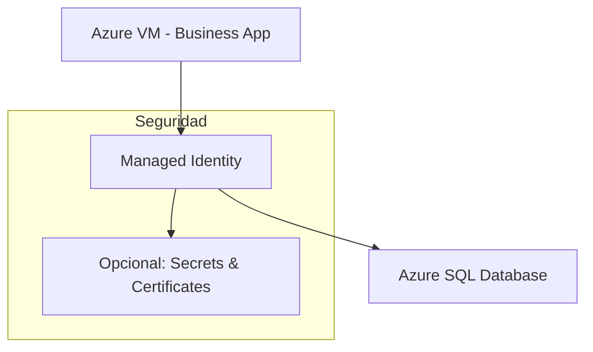
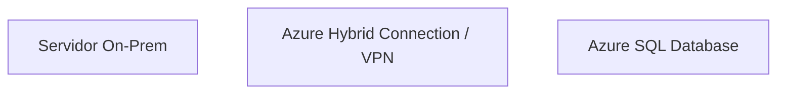

# 🧩 Caso de estudio: Diseño de soluciones de autenticación y autorización

## 🏢 Contexto

* **EstebanCalabria Industries** está creciendo y ha adquirido un **retailer online de indumentaria deportiva**.  
* También contrató un **partner externo para marketing**.  
* La empresa utiliza **Microsoft Entra ID** para la gestión de usuarios y grupos.  
* Se buscan soluciones seguras para **nuevos usuarios** y **acceso de aplicaciones**, manteniendo buenas prácticas de identidad y seguridad.

---

## 📋 Situación Actual

* **Nuevos usuarios**:
  * 75 empleados provenientes del retailer adquirido (cuentas on-premises).  
  * 15 empleados del partner externo, con cuentas en el tenant de Microsoft Entra de su empresa.  
  * Necesidad de configurar roles geográficos y de trabajo, además de cambios en roles de usuarios actuales.  

* **Acceso a aplicaciones**:
  * Aplicación en **Azure VM** que consulta **Azure SQL Database**.  
  * Servidor on-premises que debe acceder de forma segura a la base de datos sin almacenar credenciales en el código.  

---

## 📊 Enunciado

### Nuevos usuarios

* Diagramar la integración de usuarios adquiridos.  
* Diagramar la integración de usuarios del partner.  
* Indicar herramientas a utilizar.  
* Listar **3 beneficios** de la solución propuesta.  
* Recomendar **3 mejoras** a la gestión de identidades y rankearlas por importancia.

### Acceso a aplicaciones

* Proponer acceso seguro para la aplicación en Azure VM.  
* Proponer acceso seguro para recursos on-premises.  
* Aplicar los pilares del **Well-Architected Framework**.

---

## 📊 Arquitectura propuesta

### Integración de usuarios adquiridos

```mermaid
graph TD
    OnPrem_Retailer[Usuarios del retailer (on-premises)]
    Azure_AD[Microsoft Entra ID - Tenant Principal]
    Sync[Azure AD Connect / B2B Sync]

    OnPrem_Retailer --> Sync --> Azure_AD
````

**Herramientas a usar**

* **Azure AD Connect** → sincronización de cuentas on-premises.
* **Group-based Access Control** → asignación de roles basada en grupos.
* **Conditional Access Policies** → seguridad avanzada (MFA, ubicaciones, dispositivos).

**✅ Beneficios**

1. Centralización de usuarios en Entra ID.
2. Cumplimiento con roles y políticas de seguridad corporativas.
3. Reducción de errores manuales y administración más eficiente.

---

### Integración de usuarios del partner

```mermaid
graph TD
    Partner_Entra[Usuarios del partner]
    Tenant_EC[Entra ID EstebanCalabria]
    B2B_Invite[Invitación B2B]

    Partner_Entra --> B2B_Invite --> Tenant_EC
```

**✅ Beneficios**

1. No duplicar cuentas del partner → seguridad y simplicidad.
2. Acceso controlado a recursos específicos.
3. Facilidad de revocación y seguimiento.

---

### Recomendaciones de mejoras en gestión de identidades

1. **Implementar Multi-Factor Authentication (MFA)** → protección primaria ante accesos comprometidos.
2. **Habilitar Conditional Access Policies avanzadas** → control granular según ubicación, dispositivo, riesgo.
3. **Revisiones periódicas de acceso y roles** → garantizar principio de menor privilegio.

---

### Acceso a aplicaciones

#### Aplicación en Azure VM → Azure SQL



**✅ Pros**

* No se almacenan credenciales en la aplicación.
* Integración nativa con Azure SQL.
* Escalabilidad y seguridad administrada.

#### Servidor on-premises → Azure SQL



**✅ Pros**

* Acceso seguro sin exponer credenciales.
* Comunicación cifrada y controlada por red corporativa.
* Mantiene políticas de seguridad de Entra ID.

---

## ⚙️ Aplicación del Well-Architected Framework

* **Fiabilidad (Reliability)** → Managed Identity + B2B garantiza accesos consistentes y controlados.
* **Rendimiento (Performance Efficiency)** → Acceso directo Azure SQL optimizado, sin overhead de gestión de credenciales.
* **Seguridad (Security)** → MFA, Conditional Access, Managed Identity, cifrado en tránsito y reposo.
* **Optimización de costos (Cost Optimization)** → Uso de servicios nativos serverless/managed evita sobrecostos en infraestructura.
* **Operaciones (Operational Excellence)** → Monitorización con **Azure Monitor / Log Analytics**, alertas de acceso fallido, reporting de actividad.

---

## 💡 Qué mostrar en Azure

* **Azure AD Connect** → sincronización de usuarios on-premises.
* **Invitación B2B** → simulación de acceso del partner.
* **Managed Identity** → crear y asignar a VM.
* **Azure SQL Database** → asignación de roles y permisos a Managed Identity.
* **Conditional Access y MFA** → configurar políticas y mostrar efectos de acceso.
* **Application Insights / Azure Monitor** → seguimiento de acceso, errores y métricas.

