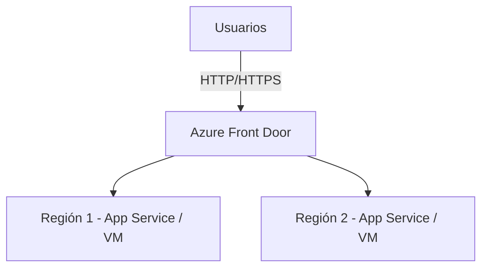
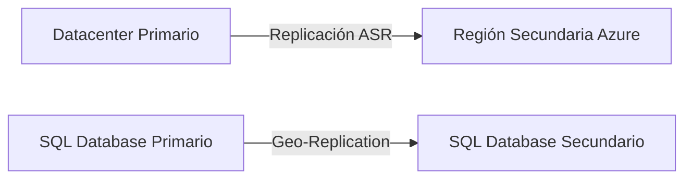

# 🧩 Caso de estudio: Diseño de una solución BCDR en Azure

## 🏢 Contexto

* **Esteban Calabria Industries** busca asegurar que sus aplicaciones críticas y datos corporativos permanezcan disponibles **incluso ante desastres o fallas críticas**.
* El objetivo es diseñar una estrategia de **continuidad de negocio y recuperación ante desastres** usando servicios de Azure, priorizando resiliencia, alta disponibilidad y recuperación rápida.

---

## 📋 Situación Actual

La empresa cuenta con:

* **Aplicaciones críticas**: ERP, CRM y una tienda online interna.
* **Infraestructura**: Un datacenter principal con VMs Windows y Linux, almacenamiento en servidores locales y bases de datos SQL Server.
* **Riesgos identificados**:

  * Fallas de hardware o red en el datacenter principal.
  * Pérdida de datos por errores humanos o software.
  * Cortes prolongados de energía o desastres naturales.
  * Necesidad de acceso rápido a datos críticos desde cualquier ubicación.

---

## 📊 Requerimientos

1. Minimizar **tiempo de inactividad** y **pérdida de datos** ante cualquier incidente.
2. Asegurar **replicación de datos críticos** en otra región de Azure.
3. Permitir **restauración rápida** de aplicaciones y bases de datos.
4. Incorporar **alertas y reportes automáticos** sobre el estado de la recuperación y backups.
5. Optimizar **costos** usando soluciones escalables y serverless cuando sea posible.

---

## ⚙️ Enunciado del Lab

* Diseñar una **estrategia BCDR** para las aplicaciones críticas y los datos de la empresa.
* Elegir **tipos de replicación** y **servicios de backup** según el tipo de recurso (VM, SQL, storage).
* Crear un **diagrama de arquitectura** de la solución BCDR.
* Explicar cómo cada componente cumple con los **pilares del Well-Architected Framework**: confiabilidad, seguridad, eficiencia, costo y operaciones.

---

## 🧩 Solución propuesta

### 1️⃣ Alta Disponibilidad (HA)

* **Aplicaciones web y front-end**:

  * Desplegar en **dos regiones de Azure** con **Azure Front Door** para balanceo global y failover automático.
* **VM críticas**:

  * Implementar **Availability Sets** o **Availability Zones** para protegerse ante fallas de hardware o rack.

---

### 2️⃣ Recuperación ante Desastres (DR)

* **Máquinas virtuales y servidores críticos**:

  * Usar **Azure Site Recovery (ASR)** para replicar VMs entre regiones.
  * Configurar **failover planificado y no planificado**.
* **Bases de datos SQL**:

  * Implementar **Active Geo-Replication** en SQL Database o **Failover Groups**.
* **Almacenamiento de blobs y archivos**:

  * Configurar **RA-GRS (Read-Access Geo-Redundant Storage)** para que los datos sean accesibles aunque una región falle.

---

### 3️⃣ Backup y Retención

* **Azure Backup** para VMs y bases de datos:

  * Políticas de **retención diaria, semanal y mensual** según criticidad.
* **Azure Blob Storage** con **soft delete** y **versioning** para proteger datos de borrado accidental.
* **Automatización**: scripts o **Azure Automation** para validar backups y generar reportes semanales.

---

### 4️⃣ Seguridad y Control de Acceso

* **Azure RBAC** para asegurar quién puede ejecutar failover o restauraciones.
* **Encryption at rest** y **en tránsito** para todos los datos replicados.
* **Azure Monitor / Log Analytics** para alertas sobre fallos de replicación o backups incompletos.

---

### 5️⃣ Optimización de Costos

* Escalar **VMs replicadas** según necesidad usando **Azure Reserved Instances** o **autoscaling**.
* Usar **serverless PaaS** (App Services, Functions) para tareas de DR testing y alertas.

---

## 🎯 Beneficios de la Solución

* **Alta disponibilidad**: usuarios no notan caídas ante fallos regionales o de hardware.
* **Recuperación rápida**: failover y restauración automatizados con mínimo RTO y RPO.
* **Seguridad**: datos replicados con cifrado y control de acceso centralizado.
* **Cumplimiento**: retención de datos según políticas corporativas y regulatorias.
* **Costo-eficiente**: recursos replicados solo cuando es crítico y serverless para tareas auxiliares.

